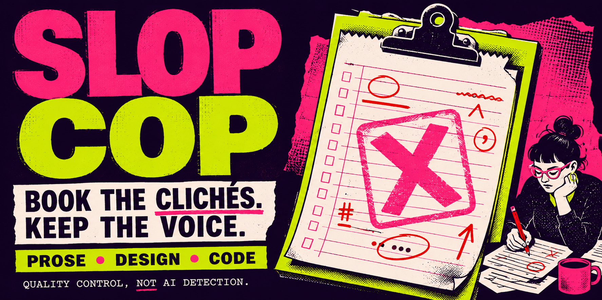
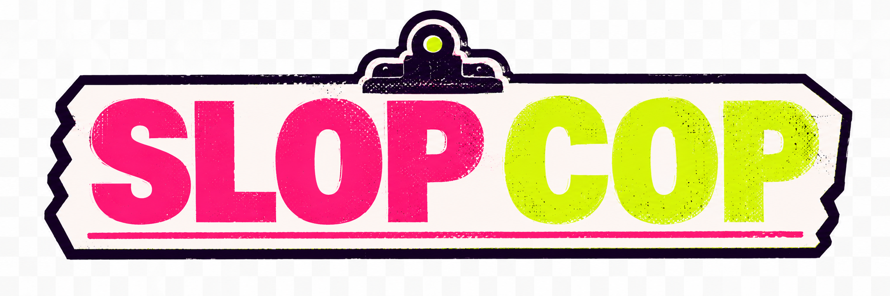
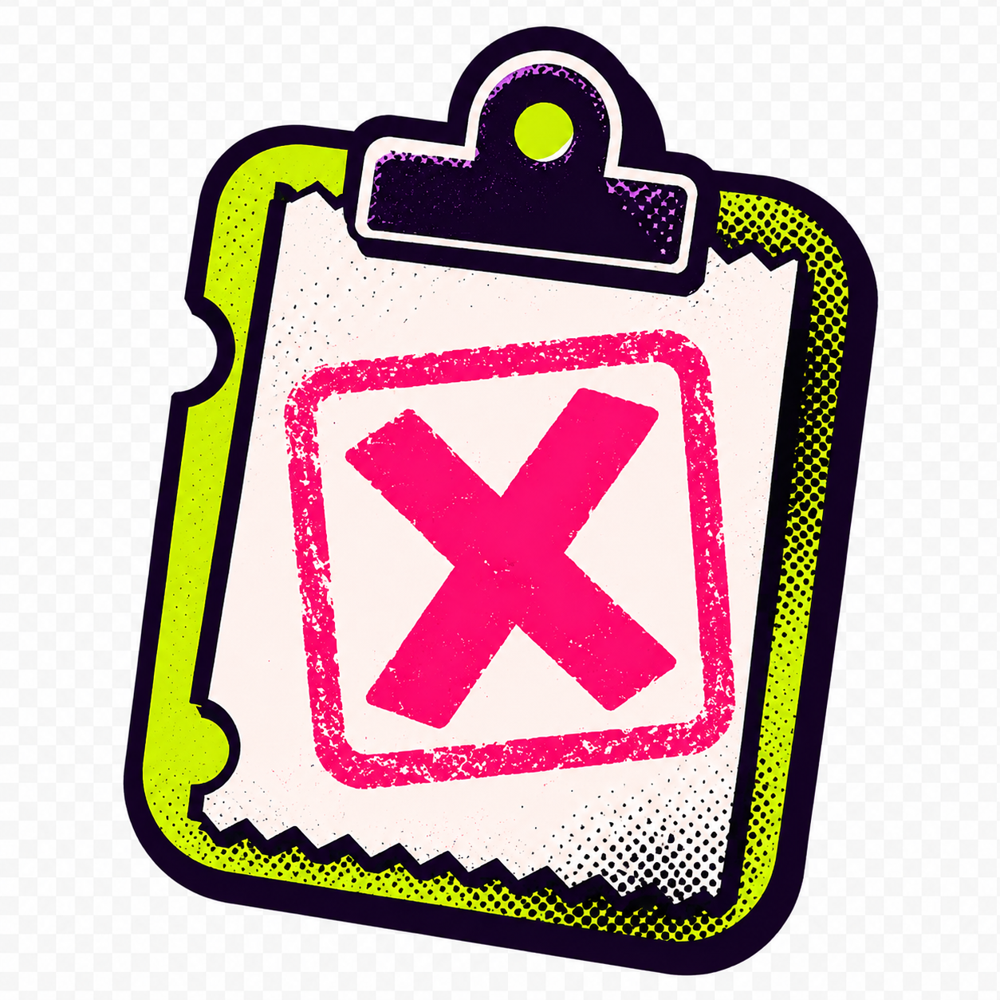

<!-- slop-cop-brand:hero:start -->
<p align="center">
  
</p>
<!-- slop-cop-brand:hero:end -->
<h1 align="center">Slop Cop 🚓</h1>

<p align="center">
  <b>Catch and remove AI slop from prose, design, and code, before it reaches a human.</b><br>
  It reads your draft the way an editor who has seen every ChatGPT tell would, tickets the slop, and hands back the fix, not just the citation.
</p>

<p align="center">
  
  
  
</p>

---

## Why use it

AI-generated prose, interfaces, and code tend to fail the same way: technically fine, completely generic. Smooth sentences that say little. A landing page that looks like every other landing page. Code that handles the happy path and nothing else. None of it is broken, so it ships, and it quietly makes everything sound like it came from no one in particular.

Slop Cop catches that layer before a reader sees it. It finds the machine's default register and replaces the vague, forgettable version with something a specific person would have written.

## How it works

Slop Cop patrols three beats and loads only the one your work needs.

**Prose** — cadence uniformity (the strongest tell as of 2026), filler openers, overused verbs and Latinate word choice, hedging, formulaic "not X, it's Y" structures, vague claims of importance, thriller-chapter headings, and pasted markup artifacts like `oaicite` and `turn0search0`. The em dash is treated as a weak, dated signal now, judged on density rather than presence.

**Design** — the cluster of untouched defaults: the indigo-to-violet gradient, Inter everywhere, the fits-anyone hero headline, three equal feature cards, motion with no purpose, plastic AI imagery, and buzzword copy with no proof behind it.

**Code** — happy-path-only logic with no config or edge cases, over-documentation of the obvious, ceremonial long names, over-modular structure, dead imports, and abstractions that don't earn their keep.

It routes automatically based on what you're delivering.

## The one law

**Replace the vague claim with a specific, checkable thing.** Under almost every fix is the same move: name the number, the person, the date, the mechanism, the actual component. If you strip a slop phrase and have nothing concrete to put in its place, that sentence had nothing to say. Cut it.

## What keeps it from over-policing

A word on the banned list isn't automatically a crime. Slop Cop respects exclusion zones (quotes, proper names, code examples), lowers severity when a word is anchored to a specific entity or date, and separates literal uses ("Beethoven's symphony") from metaphorical slop ("a symphony of features"). The target is human, not sterile.

## How it grades

Ask it to grade and it returns a score out of 50 across Directness, Specificity, Rhythm, Voice, and Density. Below 35 means revise.

The scoring is a forced procedure, not a gut call. It tallies every rhetorical device by count, caps the Rhythm and Voice axes when any single device shows up three or more times, counts specificity separately so real facts can't paper over a templated structure, checks the result against a set of calibration anchors, and reports the tally, the biggest offense, and the one change that helps most.

## Install

**Claude Code**
```bash
git clone https://github.com/howshannon/slop-cop
cp -R slop-cop ~/.claude/skills/
```

**Claude Desktop / Cowork / claude.ai** — open Settings → Capabilities (or Skills) and add or upload the skill. You can also zip the folder as `slop-cop.skill` and use the Save-skill button.

**Custom instructions / API** — paste the core rules from `SKILL.md` into your system prompt; the reference files load on demand.

## How to use it

**It runs on its own** before it hands you drafted prose, a landing page, a component, or code. You can also call it directly, any of these ways:

**De-slop a draft.** Paste the text or point at the file and say *"run Slop Cop on this,"* *"de-slop this post,"* or *"does this sound like ChatGPT?"* It returns the cleaned version and a short list of what it changed and why.

**Grade before you ship.** Say *"grade this draft."* You get the score out of 50, the device tally, and the top fix. Under 35, revise and re-run until it clears.

**Check a design.** Paste the HTML or JSX, or describe the page, and ask it to work the design beat. It flags the generic-SaaS tells and names specific replacements.

**Review code.** Point it at a diff or a file and ask for the code beat. It surfaces happy-path gaps, over-documentation, and abstractions that don't carry their weight.

Best practice: run it on anything you wrote that a human will read, and treat the score as a gate, not a grade to admire.

## What's in here

```
slopcop/
├── SKILL.md                     the rules and the forced scoring procedure
├── references/
│   ├── prose-phrases.md         banned verbs, adjectives, filler openers, plain swaps
│   ├── prose-structures.md      formulaic structures to break
│   ├── prose-examples.md        before / after rewrites
│   ├── design.md                generated-UI tells and their fixes
│   ├── code.md                  LLM code smells and their fixes
│   └── calibration-anchors.md   graded example posts for consistent scoring
├── README.md
└── LICENSE
```

## Credits

Slop Cop synthesizes and de-conflicts several open-source anti-slop projects, hardened with current research on AI writing, generated-UI, and LLM code tells. Full attributions and sources are in [CREDITS.md](CREDITS.md).

## License

MIT.


## Review outcomes

<!-- slop-cop-brand:outcomes:start -->
<p align="center">
  
</p>
<!-- slop-cop-brand:outcomes:end -->

<!-- slop-cop-brand:gallery:start -->
<details>
<summary><strong>Brand assets</strong></summary>

<br>

<p align="center">
  
</p>

<table>
  <tr>
    <td width="34%" align="center">
      
    </td>
    <td width="66%" align="center">
      
    </td>
  </tr>
  <tr>
    <td align="center"><strong>Emblem</strong></td>
    <td align="center"><strong>Social card</strong></td>
  </tr>
</table>

See [`assets/brand/README.md`](assets/brand/README.md) for intended uses and dimensions.

</details>
<!-- slop-cop-brand:gallery:end -->
